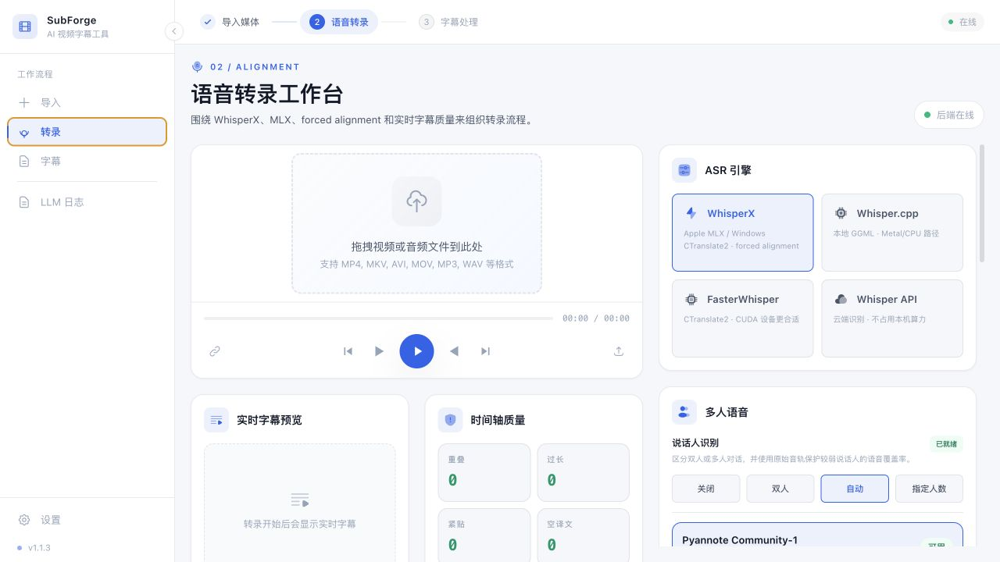
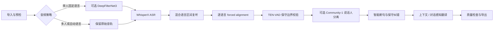
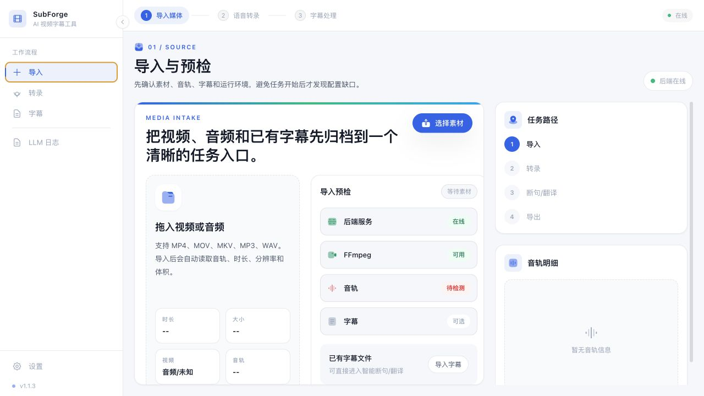
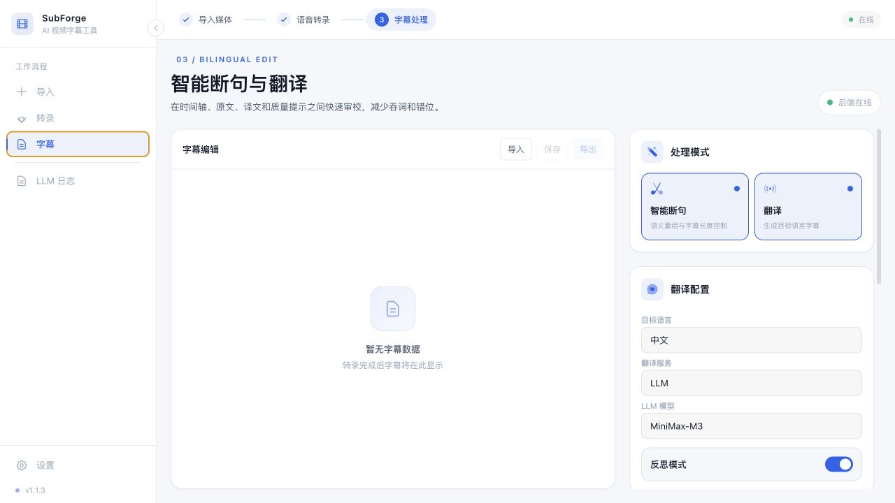

<p align="center">
  
</p>

<h1 align="center">SubForge</h1>

<p align="center">
  <strong>从本地语音识别到可发布双语字幕的一体化工作台</strong><br />
  WhisperX 精准时间轴 · 混合语言识别 · 多人分离 · 对话感知翻译
</p>

<p align="center">
  <a href="https://github.com/henry1786580051-lang/SubForge/actions/workflows/ci.yml"></a>
  <a href="https://github.com/henry1786580051-lang/SubForge/releases"></a>
  <a href="LICENSE"></a>
  
  
</p>

<p align="center">
  <a href="https://github.com/henry1786580051-lang/SubForge/releases/download/v1.1.12/SubForge-1.1.12-macos-arm64.dmg"><strong>下载 macOS Apple Silicon 版</strong></a>
  · <a href="https://github.com/henry1786580051-lang/SubForge/releases">全部版本</a>
  · <a href="https://henry1786580051-lang.github.io/SubForge/">使用文档</a>
  · <a href="https://github.com/henry1786580051-lang/SubForge/issues">问题反馈</a>
</p>



SubForge 面向需要长期处理视频字幕的创作者和本地化工作流。它将媒体预检、本地 ASR、forced alignment、说话人分离、智能断句、上下文翻译、质量检查和多格式导出组织在同一个桌面与 Web 界面中。大模型只用于需要语义判断的环节；时间轴校验、格式检查和中文标点清理均在本地完成。

## 为什么选择 SubForge

| 精准转录 | 可控翻译 | 可恢复工作流 |
| --- | --- | --- |
| Apple Silicon 使用 MLX，Windows 使用 CTranslate2；WhisperX forced alignment 与 TEN-VAD 保守校准词级边界 | 按上下文和说话人轮次翻译，校验漏译、错位、重复、占位语和思考内容泄漏 | 实时进度、中间结果增量保存、失败条目局部重试、恢复字幕和聚合 LLM 日志 |

### v1.1.12 更新

- **思考预算用于难点**：DeepSeek V4 Flash 的原生思考集中用于专名纠错、语义错位和复杂中文语序修复；常规翻译与格式审计使用轻量请求，避免只返回推理却没有最终 JSON。
- **全局术语与专名校正**：在受控长度内补充全文车型、品牌和技术术语证据，仅在上下文重复支持时修正 ASR 同音词，不对一次性名称作猜测。
- **信达雅质量门增强**：新增否定比较、反讽、口语缩写、数字省略、口误自纠和汽车专业词义检查，并阻止说明性舞台标签进入字幕。
- **字幕边界更稳健**：保护 `rev matching`、挡位名称、分离式 `take ... away` 和否定比较补语，修复时保持英文词序、时间轴和正确字幕不变。

## 工作流



### 核心能力

| 能力 | 实现与边界 |
| --- | --- |
| 本地语音识别 | WhisperX：Apple Silicon 使用 MLX Whisper；Windows 使用 Faster-Whisper/CTranslate2，可选 CUDA 或 CPU |
| 词级时间轴 | 对齐前展开数字、单位和符号；按语言选择 forced alignment 模型；TEN-VAD 只修正可疑边界 |
| 混合语言 | 自动语言探测、高置信度外语区间局部复听、逐语言对齐与缺失模型提示；手动选择源语言时不改变原有固定语言流程 |
| 多人语音 | pyannote Community-1，支持双人、自动人数或指定 2–10 人；标签只用于内部轮次，不写入最终字幕 |
| 智能断句 | 语义重组后校验原文覆盖、字幕长度、键完整性和时间轴，不允许吞词或自由改写 |
| 对话感知翻译 | 将可靠的说话人标签匿名化为临时轮次，结合前后文处理指代、问答和省略；单人任务不增加该开销 |
| 结果质量门 | 检查空译文、跨条错位、相邻重复、编辑占位语、思考内容、数字和专有名词异常，仅重试失败条目 |
| 导出 | SRT、VTT、ASS、TXT、JSON；中英双语默认中文在上、原文在下 |

<details>
<summary><strong>查看转录和翻译的技术细节</strong></summary>

#### 转录

- 单人且源语言固定时可启用 [DeepFilterNet3](https://github.com/Rikorose/DeepFilterNet)；多人和自动语言模式会跳过增强，保护弱声纹与短外语片段。
- [MLX Whisper](https://github.com/ml-explore/mlx-examples/tree/main/whisper) 为 Apple Silicon 提供本地加速；[Faster-Whisper](https://github.com/SYSTRAN/faster-whisper) 为 Windows 提供 CTranslate2 路径。
- [WhisperX](https://github.com/m-bain/whisperX) 按检测语言选择独立对齐模型。设置页可搜索、下载和检查 41 种语言模型。
- [TEN-VAD](https://github.com/TEN-framework/ten-vad) 只校验可疑句首和句尾；不可用时回退 Silero VAD，不全局覆盖正确的 WhisperX 时间戳。
- [pyannote Community-1](https://github.com/pyannote/pyannote-audio) 只负责稳定的声纹聚类，不推断人物姓名或身份。

#### 翻译

```text
语义断句 -> 保守纠错 -> 全局上下文 -> 批量翻译
  -> 可选反思 -> 漏译/错位/重复/泄漏检查
  -> 失败键局部恢复 -> 中文逗号和句号本地清理
```

- MiniMax 使用官方 Anthropic 兼容协议，原生区分 `thinking` 与最终 `text`；M3 遇到 HTTP 429 时保持任务存活并等待恢复。
- NVIDIA NIM、小米 MiMo、DeepSeek、OpenAI、通义千问及本地服务使用 OpenAI 兼容协议；Base URL、API Key 和模型按服务商独立保存。
- NVIDIA 模型目录按开发公司折叠，并支持搜索，避免将大量聊天、推理、视觉和嵌入模型平铺在同一列表中。
- NVIDIA API 与 MiniMax M3 一样在 HTTP 429 后保持任务存活，优先遵循 `Retry-After`，并持续等待服务恢复；认证错误等非限流故障仍会立即返回。
- 反思模式再次检查语气、称谓、指代和问答关系，但仍必须保持字幕键和内容所有权。
- 中间结果持续写入恢复文件，最终质量检查失败不会清空已经完成的字幕。

</details>

## 界面

| 导入与预检 | 字幕处理 |
| --- | --- |
|  |  |

## 快速开始

### 桌面版

- **macOS**：当前 v1.1.12 提供 [Apple Silicon DMG](https://github.com/henry1786580051-lang/SubForge/releases/download/v1.1.12/SubForge-1.1.12-macos-arm64.dmg)。Whisper、forced alignment 和 Community-1 模型按需下载，不会重复打包进应用。
- **Windows**：项目支持 WhisperX CTranslate2/CUDA 或 CPU、forced alignment 与 Community-1。请在 [Releases](https://github.com/henry1786580051-lang/SubForge/releases) 查看带 Windows 安装包的版本，或按下方源码方式运行。
- **Linux**：当前以 Web/CLI 源码运行和开发验证为主，尚未提供正式桌面安装包。

### Web 版

需要 Python 3.10–3.12、[uv](https://docs.astral.sh/uv/) 和 Node.js 20+。

```bash
git clone https://github.com/henry1786580051-lang/SubForge.git
cd SubForge

uv sync --extra whisperx --extra denoise
PYTHONPATH=backend uv run uvicorn app.main:app --host 127.0.0.1 --port 8000
```

另开一个终端：

```bash
cd SubForge/frontend
npm ci
npm run dev
```

打开 <http://localhost:3000>。Windows 如需 WhisperX、forced alignment 或 Community-1，同样安装 `whisperx` 可选依赖；只使用 Whisper.cpp 或云端 API 时可执行 `uv sync`。

### CLI

```bash
uv run subforge doctor
uv run subforge transcribe input.mp4 --asr whisperx --language auto --word-timestamps
uv run subforge subtitle input.srt
```

更多命令请运行 `uv run subforge --help`。桌面应用入口为 `launcher.py`，界面采用 Next.js、FastAPI 与 pywebview。

## 实测案例

### 单人英文试驾：Audi Q3

| 项目 | 实测值 |
| --- | --- |
| 视频 | [2026 Audi Q3 - New Turbo Compact SUV Real World City Commute](https://www.youtube.com/watch?v=dY6D-wNBEFM)，34:47 |
| 输入 / 输出 | 5,803 条词级片段 → 629 条中英双语字幕 |
| 模型 | `MiniMax-M3`，Anthropic 协议，批量 / 并发 10 / 10 |
| 质量 | 原文规范化相似度 99.72%；空译文、占位语、思考泄漏、时间轴重叠均为 0 |
| Token | 输入 515,779；输出 121,710；服务端缓存读取占输入 34.07% |

- [输入字幕](examples/audi_q3_word_timestamps.srt)
- [输出字幕](examples/audi_q3_minimax_m3_anthropic_processed.srt)

<details>
<summary>查看 Audi Q3 分阶段 Token 数据</summary>

| 阶段 | 请求尝试 | 成功 | 限流/重试 | 输入 Token | 缓存读取 | 输出 Token |
| --- | ---: | ---: | ---: | ---: | ---: | ---: |
| 智能断句 | 38 | 38 | 0 | 44,120 | 18,546 | 12,168 |
| 保守纠错 | 102 | 64 | 38 | 73,334 | 15,402 | 9,921 |
| 上下文生成 | 1 | 1 | 0 | 3,014 | 128 | 1,372 |
| 翻译与反思 | 117 | 114 | 3 | 395,311 | 141,647 | 98,249 |
| **合计** | **258** | **217** | **41** | **515,779** | **175,723** | **121,710** |

“限流/重试”是 HTTP 尝试次数，不是字幕失败数。缓存比例来自服务端 `cache_read_input_tokens`，不等同于固定计费折扣。
</details>

### 五人访谈

| 项目 | 实测值 |
| --- | --- |
| 视频 | [Matt Damon、Anne Hathaway、Tom Holland、Christopher Nolan 与主持人访谈](https://www.youtube.com/watch?v=9rO0FGivAvQ)，18:03 |
| ASR | MLX Large V3 FP16 + WhisperX forced alignment + Community-1 指定 5 人 |
| 输入 / 输出 | 3,777 条词级片段 → 443 条中英双语字幕 |
| 翻译 | `MiniMax-M3`，Anthropic 协议，批量 / 并发 10 / 10 |
| 质量 | 原文规范化相似度 98.58%；空译文、占位语、思考泄漏、相邻重复和时间轴重叠均为 0 |
| Token | 输入 301,951；输出 91,285；服务端缓存读取占输入 64.52% |

- [输入字幕](examples/five_speaker_interview_word_timestamps.srt)
- [输出字幕](examples/five_speaker_interview_minimax_m3_processed.srt)
- [说话人词量与时间范围](examples/five_speaker_interview_report.json)

<details>
<summary>查看五人访谈分阶段 Token 数据</summary>

| 阶段 | 请求尝试 | 成功 | 限流/重试 | 输入 Token | 缓存读取 | 输出 Token |
| --- | ---: | ---: | ---: | ---: | ---: | ---: |
| 智能断句 | 149 | 130 | 19 | 49,356 | 37,779 | 10,091 |
| 保守纠错 | 77 | 47 | 30 | 43,455 | 15,877 | 6,705 |
| 翻译、反思与定向复核 | 182 | 147 | 35 | 209,140 | 141,158 | 74,489 |
| **合计** | **408** | **324** | **84** | **301,951** | **194,814** | **91,285** |

片中包含电影原片段。“指定 5 人”约束访谈参与者聚类数量，不代表人物身份识别；最终字幕不会输出说话人标签。
</details>

## 项目结构与开发

```text
SubForge/
├── frontend/        # Next.js 界面
├── backend/         # FastAPI 服务
├── subforge/        # Python 核心库与 CLI
├── docs/            # VitePress 文档
├── resource/        # 字体、图标、翻译和样式资源
├── tests/           # 自动化测试
└── examples/        # 可复核的字幕案例
```

```bash
uv sync --group dev
uv run pytest
uv run ruff check .

cd frontend
npm ci
npm run lint
npm run build
```

- [完整文档](https://henry1786580051-lang.github.io/SubForge/)
- [贡献指南](docs/dev/contributing.md)
- [问题反馈](https://github.com/henry1786580051-lang/SubForge/issues)

## 许可证

SubForge 基于 [GPL-3.0 License](LICENSE) 发布。
